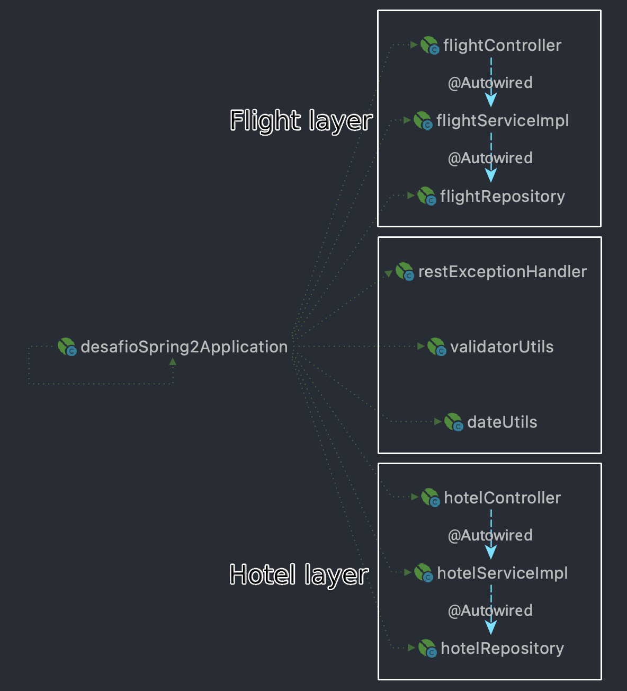
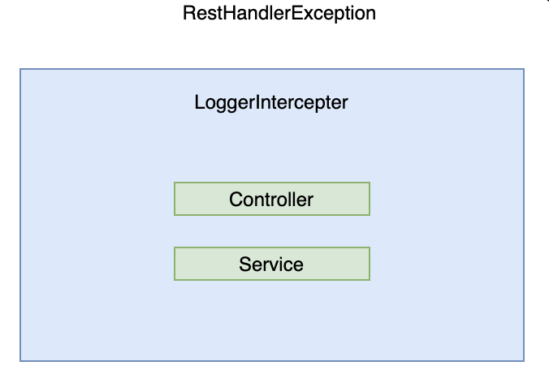

# hotel-flights-reservation
This structure can provide a simple Hotel and Flight reservation.

---
# requisites
To run application: `mvn spring-boot:run` with the required params:

---
| prop | details |
| --- | --- |
| database.directory | path of the database resources |
| database.hotels.filename | hotels database filename in csv |
| database.flights.filename | flights database filename in csv |
---

Example of normal execution by command line:
`mvn spring-boot:run -Dspring-boot.run.arguments="--database.directory=/usr/localhost/test --database.hotels.filename=dbHotels.csv --database.flights.filename=dbFlights.csv"`

By default, it's run in `localhost:8080` with local profile

`It's required Java 1.8 version.`

---
# project architecture

### layers
- RestHandlerException layer
- Controller layer
- Service layer
- Unit tests Jacoco + Junit
  - Models objects
  - Api objects
  - Controller tests

### structure diagrams

# considerations to continuous improvement:
- The object's used to make a reservation, BookingDTO and FlightReservationDTO, will could implement a ReservationDTO, in order to avoid redundant information between both objects.
  - The same can be applied to Response object.
- The structure of the repository was inspired by Spring JPA.
